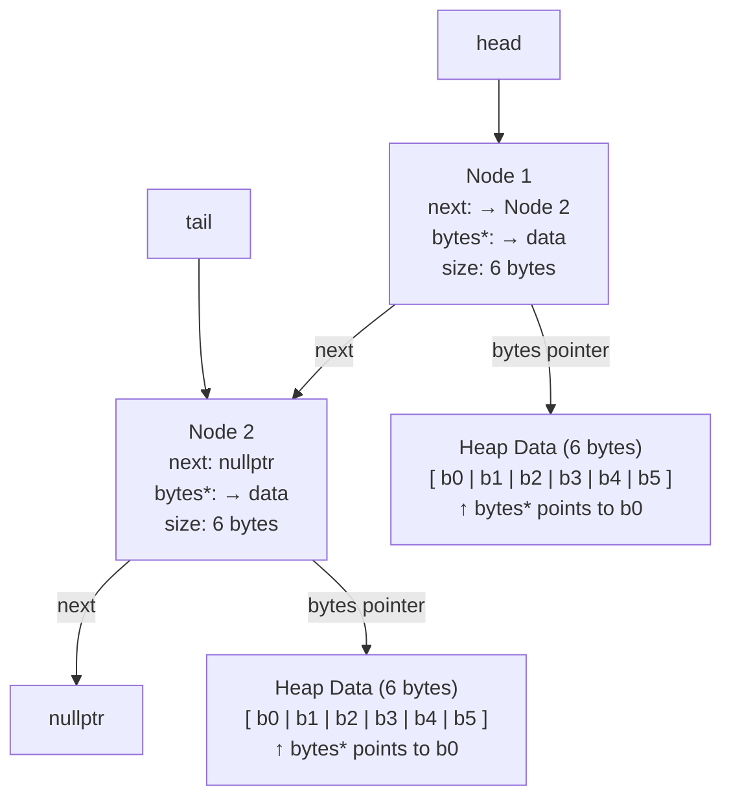

#########
Which program is fastest? Is it always the fastest?
A: Fastest Program: alloca.out reamined the fastest at an avg: 0.018 until the NUM_BLOCK size was increased to 1,000,000. At that point malloc.cpp became the fastest at an avg: 0.16 when the block size increased. 

Which program is slowest? Is it always the slowest?
A: The slowest program that retained the slowest speeds during these tests was new.out. It maintained a avg of .23 or higher. 

Was there a trend in program execution time based on the size of data in each Node? If so, what, and why?
A: Runtime would increase as the data size increased along with the amount of memory being used. 

Was there a trend in program execution time based on the length of the block chain?
A: the trend scaled in a linear manner, with NUMB_BLOCKS as the sizes kept increasing during the tests. 

Consider heap breaks, what's noticeable? Does increasing the stack size affect the heap? Speculate on any similarities and differences in programs?
A: Increasing the stack size does affect the heap. There is one program with a smallzer stack size compared to the rest. Both list.out and new.out came out with similar numbers in the stack size. 

make breaks NUM_BLOCKS=1000000
alloca.out:        69
list.out:          933
malloc.out:        751
new.out:           933

Considering either the malloc.cpp or alloca.cpp versions of the program, generate a diagram showing two Nodes. Include in the diagram
the relationship of the head, tail, and Node next pointers show the size (in bytes) and structure of a Node that allocated six bytes of data
include the bytes pointer, and indicate using an arrow which byte in the allocated memory it points to.
A: 

There's an overhead to allocating memory, initializing it, and eventually processing (in our case, hashing it). For each program, were any of these tasks the same? Which one(s) were different?
A: Each number was given the same amount of bytes so the tests are identical across every program. The memory allocation impacted the speeds of the tests whilst alloca.out was the fastest  as it had minimal allocation. 

As the size of data in a Node increases, does the significance of allocating the node increase or decrease?
A: As the data increases the significance of allocating the node decreases. As bytes increase the program works to traverse the list and hash all the bytes
