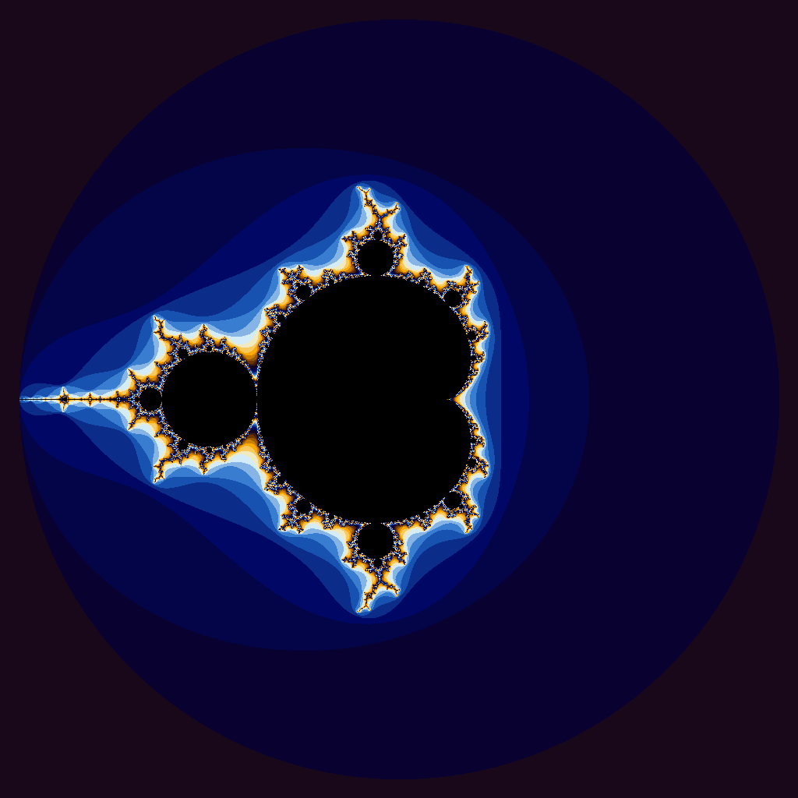

### iota CUDA Implementation
At a glance I assumed that the GPU Machine would be able to produce faster results but the CPU Version was already efficient as it was. Looking at the results from iota didn't produce great results to show that CUDA was the appropriate implementation.

I think that it wasn't a good solution for this problem as every item in the array has a simple calculation. So the GPU doesn't have enough complexity to actually accelerate. The CUDA version also occupies more resources launching the kernel itself and copying the memory from CPU to GPU which could use up more resources than the actual computations themselve. 

## Julia Set Image

CUDA generated Mandelbrot 